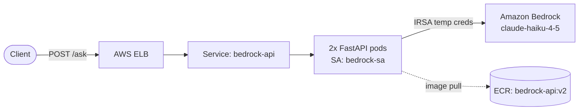

# EKS + AI Lab 🚀

A hands-on, incremental lab series that builds a **production-shaped path** for
running an AI application on **Amazon EKS** — from a bare cluster to a
container calling **Amazon Bedrock** with zero static credentials, served
through a load balancer, and shipped from a scanned private registry.

Each lab is self-contained, follows AWS **Well-Architected** principles, and
ends with a working, verifiable result.

[](https://github.com/prashantnu01/eks-ai-lab/actions/workflows/ci.yml)


---

## What it does

A FastAPI service (`bedrock-api`) exposes `POST /ask`. A request flows through an
AWS ELB to pods on EKS, which call Amazon Bedrock (`claude-haiku-4-5`) and return
the model's answer — **authorized entirely through IRSA, with no AWS keys
anywhere in the cluster.**

```bash
curl -X POST "http://<ELB-DNS>/ask" \
  -H "Content-Type: application/json" \
  -d '{"question": "What is IRSA?"}'
```

## Architecture



Full diagrams — including the IRSA credential sequence — are in
[`docs/architecture.md`](docs/architecture.md).

## Lab series

| Lab | Title | Focus | Status |
|----:|-------|-------|:------:|
| 1 | [EKS + IRSA + Bedrock](labs/lab1-eks-irsa-bedrock.md) | Cluster, OIDC, keyless Bedrock call | ✅ |
| 2 | [App + Deployment + Service](labs/lab2-app-deployment.md) | FastAPI, probes, rolling update, ELB | ✅ |
| 3 | [ECR + scanning + CVE fix](labs/lab3-ecr-scanning.md) | Private registry, scan-on-push, 6→0 CVEs | ✅ |
| 4 | [Karpenter](labs/lab4-karpenter.md) | Dynamic / Spot node provisioning | 🚧 |
| 5 | HPA | Pod autoscaling | 🔜 |
| 6 | Kyverno + NetworkPolicies | Policy enforcement | 🔜 |
| 7 | ArgoCD | GitOps deploys | 🔜 |
| 8 | CloudWatch Container Insights | Observability + Bedrock logging | 🔜 |

## Repository layout

```
eks-ai-lab/
├── app/                  # FastAPI app + Dockerfile (v2, 0 CVEs)
│   ├── app.py
│   ├── Dockerfile
│   ├── requirements.txt
│   └── .dockerignore
├── k8s/                  # Kubernetes manifests
│   ├── deployment.yaml   # 2 replicas, probes, RollingUpdate maxUnavailable:0
│   ├── service.yaml      # LoadBalancer -> AWS ELB
│   └── karpenter/        # Lab 4 — dynamic node provisioning
│       ├── ec2nodeclass.yaml  # how nodes are built (AL2023)
│       └── nodepool.yaml      # Spot+On-Demand, right-sizing, consolidation
├── docs/
│   └── architecture.md   # System + IRSA + Karpenter diagrams (Mermaid)
├── scripts/
│   ├── rebuild.sh        # Full environment rebuild (~20 min)
│   └── cleanup.sh        # App-only or full teardown
├── labs/                 # Per-lab write-ups (lab1 … lab4)
└── README.md
```

## Quickstart

> Prereqs: `aws` CLI (authenticated), `eksctl`, `kubectl`, `docker`.
> Set your account id first: `export ACCOUNT_ID=123456789012`

```bash
# Build the whole environment (cluster + IRSA + ECR auth + deploy)
./scripts/rebuild.sh

# Verify
kubectl get pods -l app=bedrock-api
kubectl exec <pod> -- aws sts get-caller-identity   # shows assumed-role => IRSA works

# Tear down to stop costs
./scripts/cleanup.sh           # app only (keeps cluster)
./scripts/cleanup.sh --all     # full teardown
```

## Cluster snapshot

| Property | Value |
|---|---|
| Cluster | `eks-ai-lab` (us-east-1) |
| Kubernetes | 1.34, Amazon Linux 2023 |
| Nodes (Labs 1–3) | t3.medium × 2 (static managed node group) |
| Nodes (Lab 4 →) | Karpenter-provisioned, right-sized, Spot + On-Demand |
| IRSA SA | `bedrock-sa` → `AmazonBedrockFullAccess` |
| Image | `bedrock-api:v2` (private ECR, scan-on-push, 0 CVEs) |
| Model | `us.anthropic.claude-haiku-4-5-20251001-v1:0` |
| Est. cost (Labs 1–3) | ~$0.154/hr (~$3.70/day) static |
| Est. cost (Lab 4 target) | ~40–60% lower via Spot + consolidation *(record actuals after running)* |

## Well-Architected coverage

| Pillar | Applied |
|---|---|
| **Security** | IRSA (no static keys), private ECR, non-root container, image scanning |
| **Reliability** | Managed control plane, 2 replicas, liveness/readiness probes, rolling update |
| **Performance** | Resource requests/limits; Karpenter right-sizes instances per workload (Lab 4) |
| **Cost** | Tagged resources, delete-when-idle discipline; Spot + consolidation via Karpenter (Lab 4) |
| **Operational excellence** | eksctl (IaC), declarative manifests, automated ECR scans |

## Gotchas worth remembering

- Claude 4.x on Bedrock needs the `us.` inference-profile prefix.
- ECR auth tokens and SSO sessions expire ~12h — re-authenticate.
- Purge OS packages **in the same `RUN` layer** as install, or the image won't shrink.
- `COPY requirements.txt` **before** `COPY app.py` to keep dependency layers cached.

## License

[MIT](LICENSE) © 2026 Prashant Kumar
