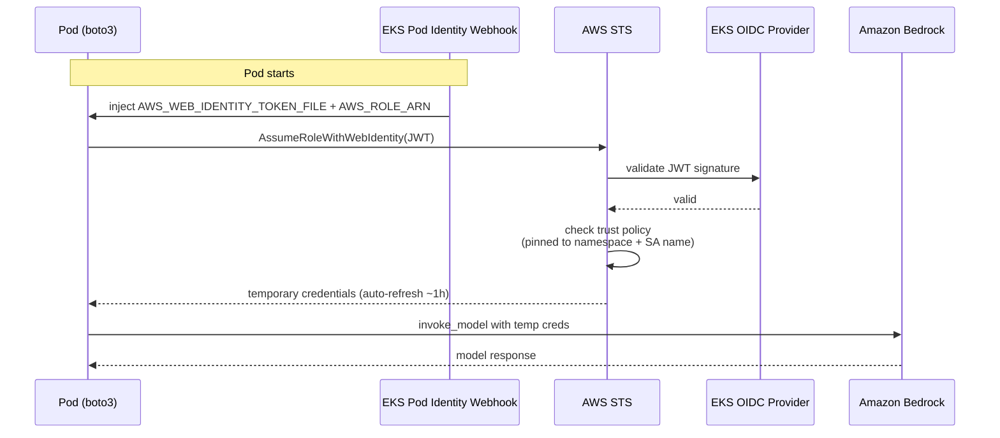

# Architecture

## System overview

## IRSA credential flow

No static AWS keys exist anywhere in the cluster. Every Bedrock call is authorized
through short-lived credentials minted per-pod:

## Why these choices

| Decision | Reason |
|---|---|
| IRSA over static keys | No long-lived secrets; creds scoped to one service account and auto-rotated |
| `maxUnavailable: 0` rollout | Readiness-gated, zero-downtime deploys (v1 → v2 proved it) |
| Same-layer `perl` purge | Removing files in the same `RUN` layer as install shrinks the image and cleared 6 CVEs |
| `us.` model prefix | Claude 4.x on Bedrock requires a cross-region inference profile, not a bare model id |
| LoadBalancer Service | Lets the AWS cloud controller provision and manage the ELB declaratively |
