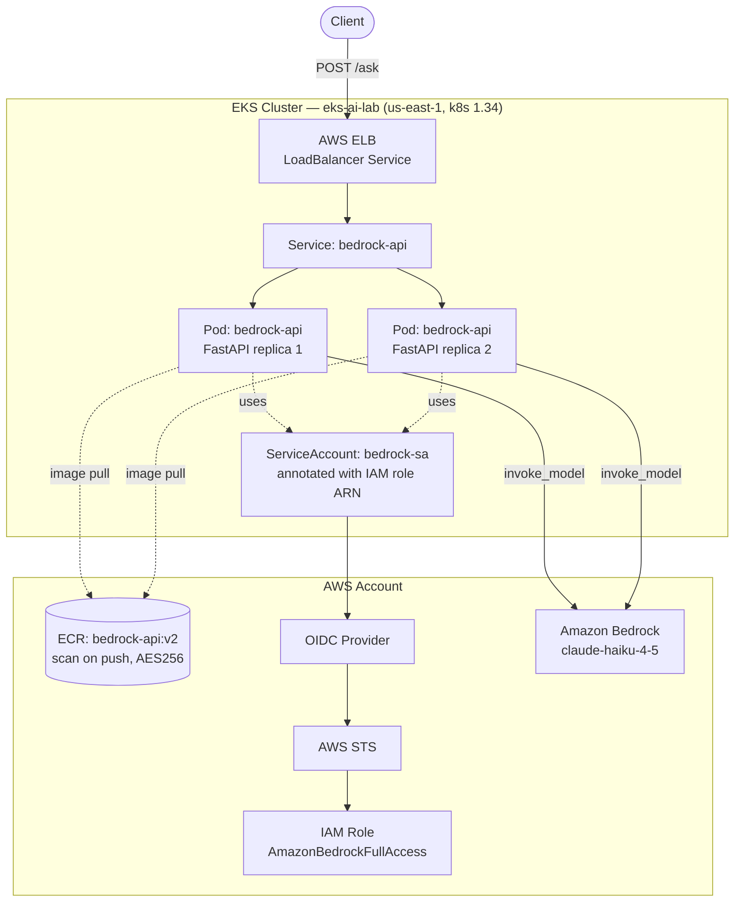
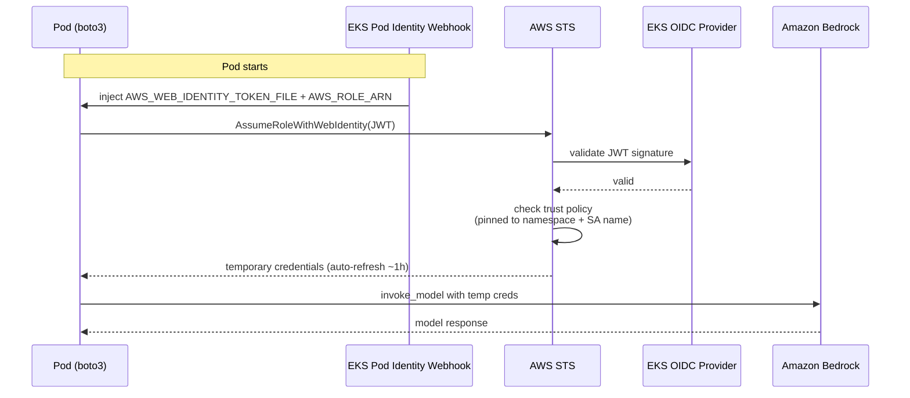
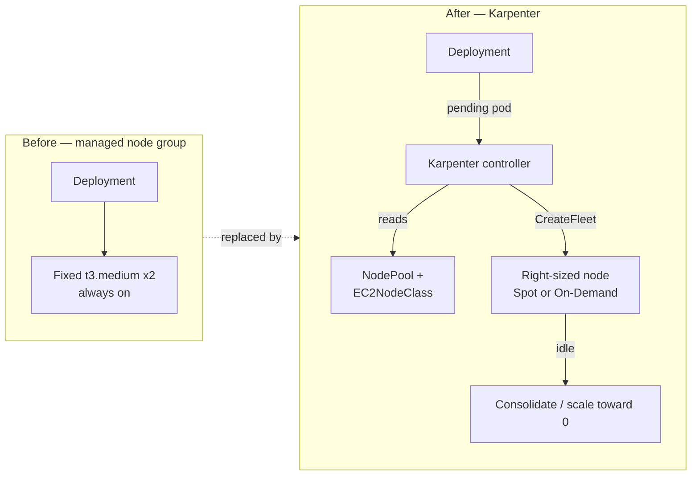
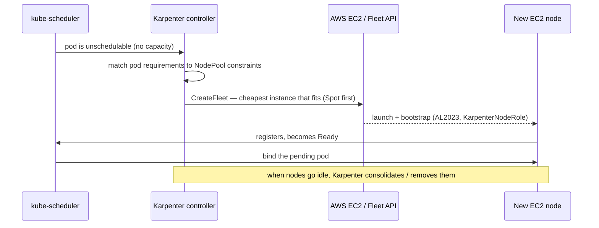

# Architecture

## System overview

## IRSA credential flow

No static AWS keys exist anywhere in the cluster. Every Bedrock call is authorized
through short-lived credentials minted per-pod:

## Why these choices

| Decision | Reason |
|---|---|
| IRSA over static keys | No long-lived secrets; creds scoped to one service account and auto-rotated |
| `maxUnavailable: 0` rollout | Readiness-gated, zero-downtime deploys (v1 → v2 proved it) |
| Same-layer `perl` purge | Removing files in the same `RUN` layer as install shrinks the image and cleared 6 CVEs |
| `us.` model prefix | Claude 4.x on Bedrock requires a cross-region inference profile, not a bare model id |
| LoadBalancer Service | Lets the AWS cloud controller provision and manage the ELB declaratively |

---

## Lab 4 — Karpenter node provisioning

> **Status: in progress.** Full runbook in [`labs/lab4-karpenter.md`](../labs/lab4-karpenter.md).

### What changes

Labs 1–3 run on a **static managed node group** — a fixed `t3.medium × 2` that is
always on whether or not the workload needs it. Lab 4 replaces that with
**Karpenter**, which provisions nodes *on demand* in response to unschedulable pods.

### Provisioning flow

### Why Karpenter

| Decision | Reason |
|---|---|
| Karpenter over static node group | Provisions the exact instance a pending pod needs, instead of paying for fixed idle capacity |
| Spot + On-Demand mix | Spot for cost, On-Demand fallback for availability — ~40–60% cheaper for bursty lab workloads |
| Instance flexibility (`t`/`m`/`c`, gen > 2) | Lets Karpenter right-size per workload rather than pinning one type |
| `consolidationPolicy: WhenEmptyOrUnderutilized` | Bin-packs and scales toward zero when idle — the core cost win |
| `limits.cpu` on the NodePool | Hard ceiling so a runaway scale-up can't provision unbounded EC2 |
| SQS interruption queue | Graceful drain on Spot reclamation rather than abrupt pod loss |

### What it sets up

Karpenter scales **nodes**; the next lab (HPA) scales **pods**. Together they form
the full autoscaling story: HPA adds pods under load → Karpenter adds nodes to fit
them → both scale back down when the load passes.
