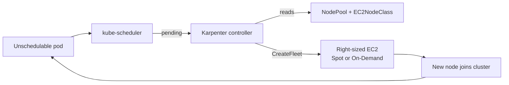

# Lab 4 — Karpenter (dynamic node provisioning)

> **Status: planned / runbook.** Labs 1–3 are complete and live. This document is
> the plan for the next session. As you execute each step, convert the notes to
> past tense and record actual values (role ARNs, instance types provisioned, cost
> delta) the way Labs 1–3 do.

**Goal:** Replace the static `t3.medium × 2` managed node group with **Karpenter**,
so nodes are provisioned on demand — right-sized per workload, mixing **Spot +
On-Demand**, and scaled to zero when idle.

## Why Karpenter (vs the managed node group from Labs 1–3)

| Managed node group (now) | Karpenter (target) |
|---|---|
| Fixed `t3.medium × 2`, always on | Provisions the *exact* instance an unschedulable pod needs |
| Manual scaling / fixed min-max | Watches the scheduler; adds/removes nodes in seconds |
| On-Demand only | Mixes Spot + On-Demand automatically |
| Pay for idle capacity | Consolidates and scales toward zero when idle |

Typical result: **40–60% lower compute cost** for bursty/lab workloads.

## What changes architecturally



## Prerequisites
- Running `eks-ai-lab` cluster with OIDC enabled (from Lab 1). ✅
- `helm`, `kubectl`, `aws`, `eksctl` available and authenticated.
- Export shared vars (used by every command below):

```bash
export CLUSTER_NAME=eks-ai-lab
export AWS_REGION=us-east-1
export ACCOUNT_ID=<ACCOUNT_ID>
export KARPENTER_VERSION=1.1.1        # pin to a current v1.x release
export AWS_PAGER=""
```

> **Note (from Lab 3 context):** set `autoModeConfig.enabled: false` in the cluster
> config so EKS Auto Mode doesn't conflict with self-managed Karpenter.

## Steps

### 1. Create the Karpenter IAM roles
Karpenter needs two roles: a **controller role** (IRSA — calls the EC2/fleet APIs)
and a **node role** (what the launched instances run as). The official
CloudFormation template provisions both plus the instance profile and SQS interrupt queue:

```bash
curl -fsSL "https://raw.githubusercontent.com/aws/karpenter-provider-aws/v${KARPENTER_VERSION}/website/content/en/preview/getting-started/getting-started-with-karpenter/cloudformation.yaml" \
  > karpenter-cfn.yaml

aws cloudformation deploy \
  --stack-name "Karpenter-${CLUSTER_NAME}" \
  --template-file karpenter-cfn.yaml \
  --capabilities CAPABILITY_NAMED_IAM \
  --parameter-overrides "ClusterName=${CLUSTER_NAME}"
```

Then create the IRSA service account binding for the controller:

```bash
eksctl create iamserviceaccount \
  --cluster "${CLUSTER_NAME}" --region "${AWS_REGION}" \
  --namespace kube-system --name karpenter \
  --role-name "KarpenterControllerRole-${CLUSTER_NAME}" \
  --attach-policy-arn "arn:aws:iam::${ACCOUNT_ID}:policy/KarpenterControllerPolicy-${CLUSTER_NAME}" \
  --approve --override-existing-serviceaccounts
```

### 2. Let Karpenter nodes join the cluster (aws-auth)
The node role must be allowed to register as a node:

```bash
eksctl create iamidentitymapping \
  --cluster "${CLUSTER_NAME}" --region "${AWS_REGION}" \
  --arn "arn:aws:iam::${ACCOUNT_ID}:role/KarpenterNodeRole-${CLUSTER_NAME}" \
  --group system:bootstrappers --group system:nodes \
  --username "system:node:{{EC2PrivateDNSName}}"
```

### 3. Tag subnets & security groups for discovery
Karpenter discovers where to launch nodes via tags. Tag the cluster's subnets and
node security group:

```bash
# (Example — confirm the actual subnet/SG ids from your VPC first)
aws ec2 create-tags --tags "Key=karpenter.sh/discovery,Value=${CLUSTER_NAME}" \
  --resources <subnet-id-1> <subnet-id-2> <node-security-group-id>
```

### 4. Install Karpenter via Helm
```bash
helm upgrade --install karpenter oci://public.ecr.aws/karpenter/karpenter \
  --version "${KARPENTER_VERSION}" \
  --namespace kube-system \
  --set "settings.clusterName=${CLUSTER_NAME}" \
  --set "settings.interruptionQueue=${CLUSTER_NAME}" \
  --set controller.resources.requests.cpu=0.5 \
  --set controller.resources.requests.memory=512Mi \
  --wait

kubectl get pods -n kube-system -l app.kubernetes.io/name=karpenter
```

### 5. Create the EC2NodeClass (how nodes are built)
```yaml
# k8s/karpenter/ec2nodeclass.yaml
apiVersion: karpenter.k8s.aws/v1
kind: EC2NodeClass
metadata:
  name: default
spec:
  amiFamily: AL2023            # Amazon Linux 2023, matches Labs 1-3
  role: "KarpenterNodeRole-eks-ai-lab"
  amiSelectorTerms:
    - alias: al2023@latest
  subnetSelectorTerms:
    - tags:
        karpenter.sh/discovery: "eks-ai-lab"
  securityGroupSelectorTerms:
    - tags:
        karpenter.sh/discovery: "eks-ai-lab"
  tags:
    Environment: lab
    Owner: prashant
    Project: eks-ai-lab
    CostCenter: learning
```

### 6. Create the NodePool (what Karpenter is allowed to launch)
```yaml
# k8s/karpenter/nodepool.yaml
apiVersion: karpenter.sh/v1
kind: NodePool
metadata:
  name: default
spec:
  template:
    spec:
      nodeClassRef:
        group: karpenter.k8s.aws
        kind: EC2NodeClass
        name: default
      requirements:
        - key: kubernetes.io/arch
          operator: In
          values: ["amd64"]
        - key: karpenter.sh/capacity-type
          operator: In
          values: ["spot", "on-demand"]     # Spot first, On-Demand fallback
        - key: karpenter.k8s.aws/instance-category
          operator: In
          values: ["t", "m", "c"]            # let Karpenter right-size
        - key: karpenter.k8s.aws/instance-generation
          operator: Gt
          values: ["2"]
  limits:
    cpu: "16"                                # hard ceiling for the lab
  disruption:
    consolidationPolicy: WhenEmptyOrUnderutilized
    consolidateAfter: 1m                     # bin-pack aggressively for cost
```

```bash
kubectl apply -f k8s/karpenter/ec2nodeclass.yaml
kubectl apply -f k8s/karpenter/nodepool.yaml
```

### 7. Cut over from the managed node group
With Karpenter running, drain and delete the static node group so Karpenter takes
over all scheduling:

```bash
eksctl delete nodegroup --cluster "${CLUSTER_NAME}" --region "${AWS_REGION}" \
  --name standard-workers --drain=true
```

Karpenter sees the now-unschedulable `bedrock-api` pods and provisions a node for them.

### 8. Verify
```bash
# Watch a node get provisioned as pods go pending
kubectl get nodes -w

# What did Karpenter launch? (look for Spot + a right-sized type, not t3.medium x2)
kubectl get nodeclaims
kubectl get nodes -L karpenter.sh/capacity-type -L node.kubernetes.io/instance-type

# App still healthy through the cutover
kubectl get pods -l app=bedrock-api
ELB=$(kubectl get service bedrock-api -o jsonpath='{.status.loadBalancer.ingress[0].hostname}')
curl -X POST "http://$ELB/ask" -H "Content-Type: application/json" \
  -d '{"question":"Still alive after the Karpenter cutover?"}'

# Scale up to watch Karpenter add capacity, then scale down to watch consolidation
kubectl scale deployment bedrock-api --replicas=8
kubectl scale deployment bedrock-api --replicas=2
```

## Cleanup
```bash
kubectl delete -f k8s/karpenter/nodepool.yaml      # removes Karpenter-managed nodes
kubectl delete -f k8s/karpenter/ec2nodeclass.yaml
helm uninstall karpenter -n kube-system
aws cloudformation delete-stack --stack-name "Karpenter-${CLUSTER_NAME}"
```

## Key learnings — results (fill in after running)

> Capture the real values here as you execute, then flip the Lab 4 status to ✅
> in the README and convert this doc to past tense (matching Labs 1–3).

| Metric | Lab 1–3 baseline | Lab 4 actual (fill in) | How to get it |
|---|---|---|---|
| Node instance type(s) | `t3.medium × 2` (fixed) | _____ | `kubectl get nodes -L node.kubernetes.io/instance-type` |
| Capacity type (Spot/On-Demand) | On-Demand only | _____ | `kubectl get nodes -L karpenter.sh/capacity-type` |
| Spot interruption seen? | n/a | _____ | check Karpenter logs / `kubectl get nodeclaims` |
| Provisioning latency (pending → Ready) | n/a (always on) | _____ s | time between `kubectl get pods` pending and node `Ready` |
| Cost (~$/day) | ~$3.70/day | _____ | AWS Cost Explorer, filtered by `Project=eks-ai-lab` tag |
| Consolidation on scale `8 → 2` | n/a | _____ | `kubectl get nodes -w` after `kubectl scale ... --replicas=2` |

**Notes / surprises:** _____

## Gotchas (anticipated)
- `karpenter.sh/v1` (NodePool) and `karpenter.k8s.aws/v1` (EC2NodeClass) are the
  current stable API groups — older guides use `v1beta1`; don't mix them.
- The **discovery tags must match** on subnets *and* security groups, or Karpenter
  finds nowhere to launch and pods stay pending.
- Don't delete the managed node group *before* Karpenter is healthy — Karpenter's
  own controller pods need somewhere to run.
- Set a `limits.cpu` on the NodePool so a runaway scale-up can't provision unbounded
  EC2 (cost guardrail).
- Spot capacity can be reclaimed; the SQS interruption queue (from the CFN template)
  lets Karpenter drain gracefully — confirm it's wired via `settings.interruptionQueue`.

## Closes which gaps (from the series roadmap)
- ✅ Static node group → dynamic provisioning
- ✅ No Spot usage → Spot + On-Demand mix
- Sets up **Lab 5 (HPA)**: HPA scales pods, Karpenter then scales nodes to fit them.
